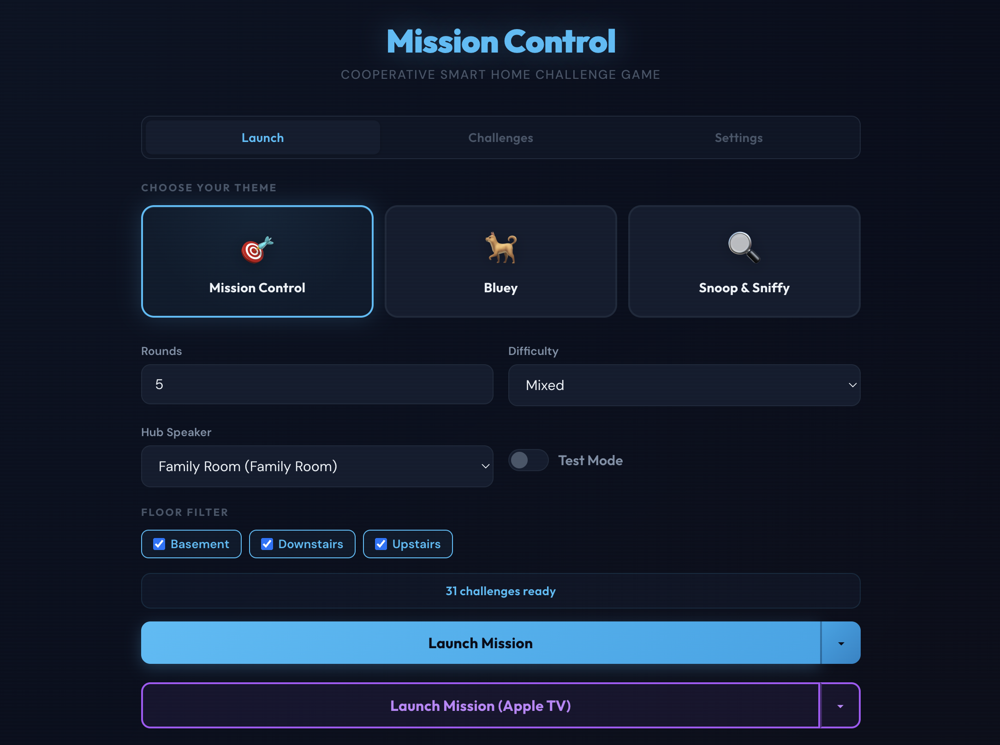
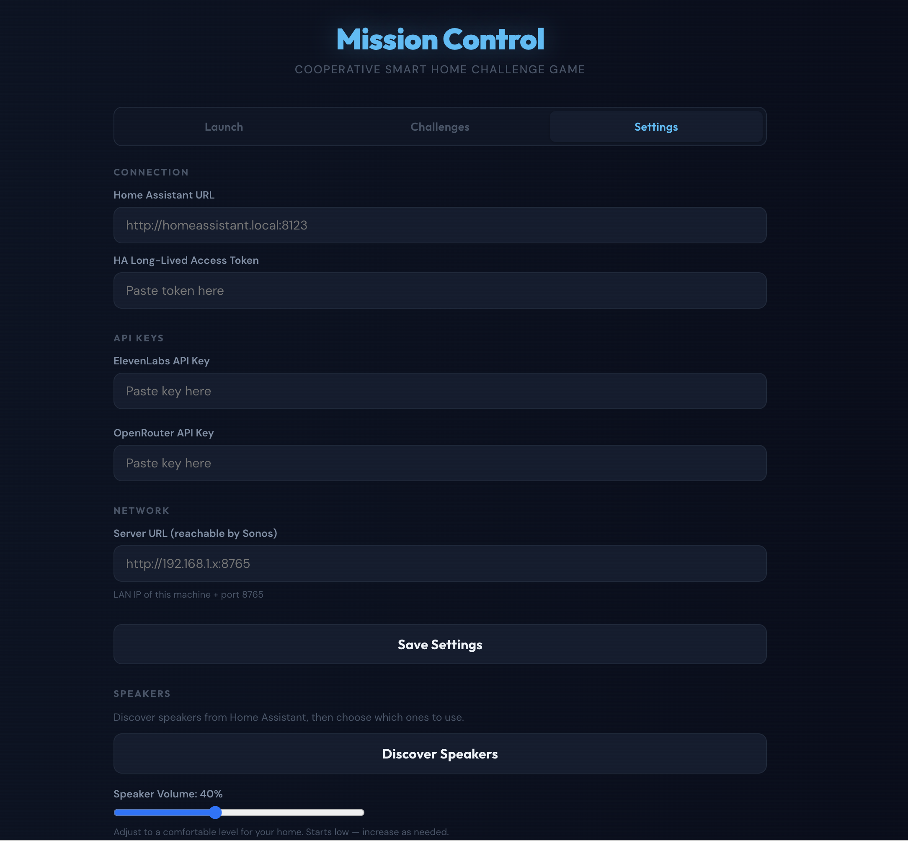
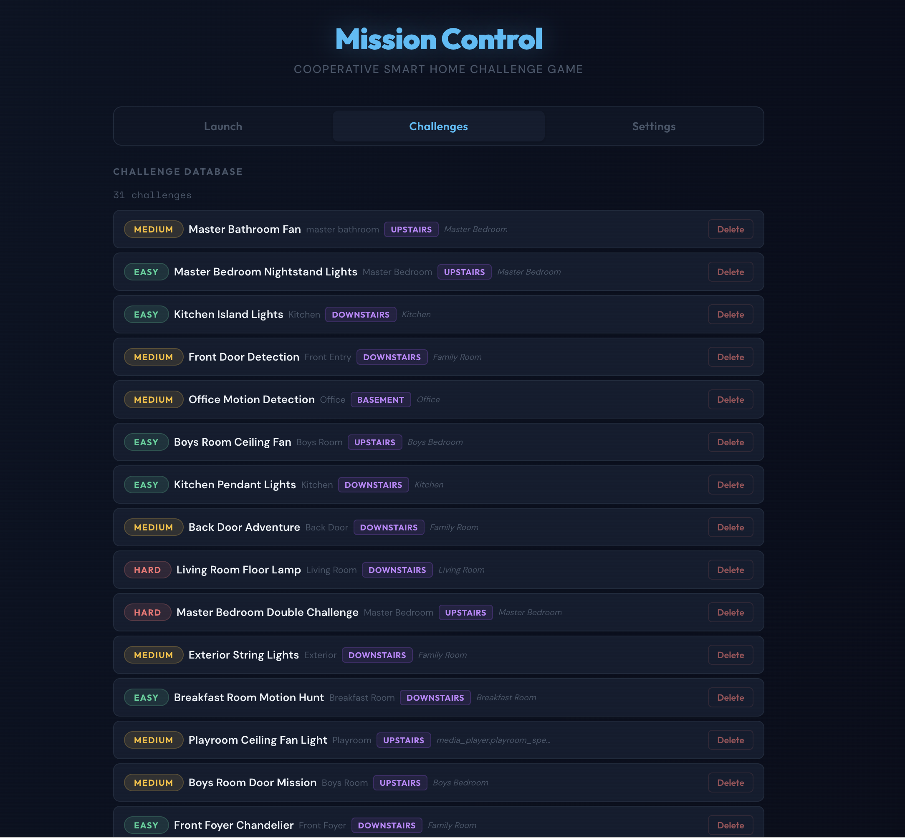
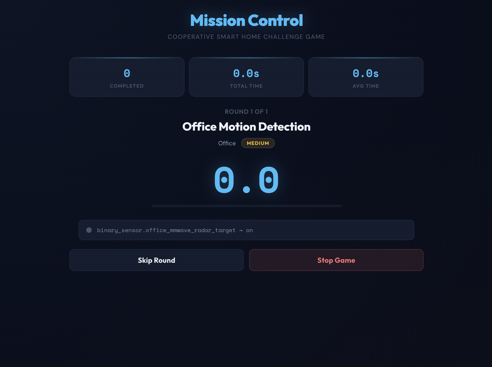
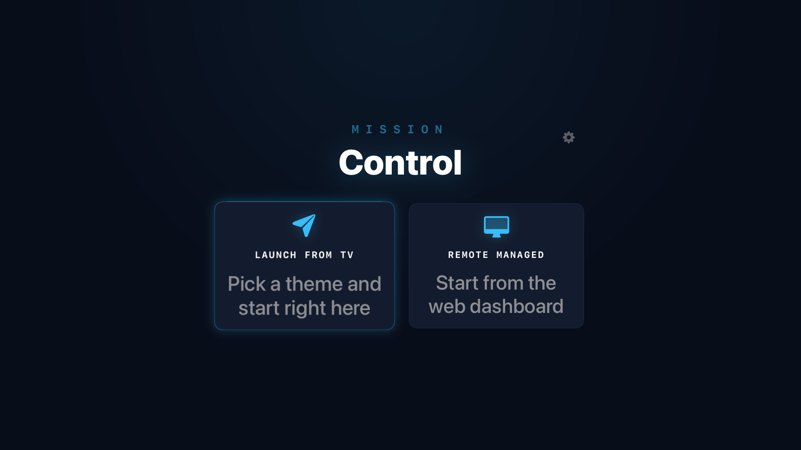
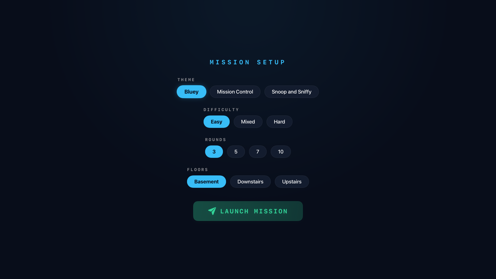
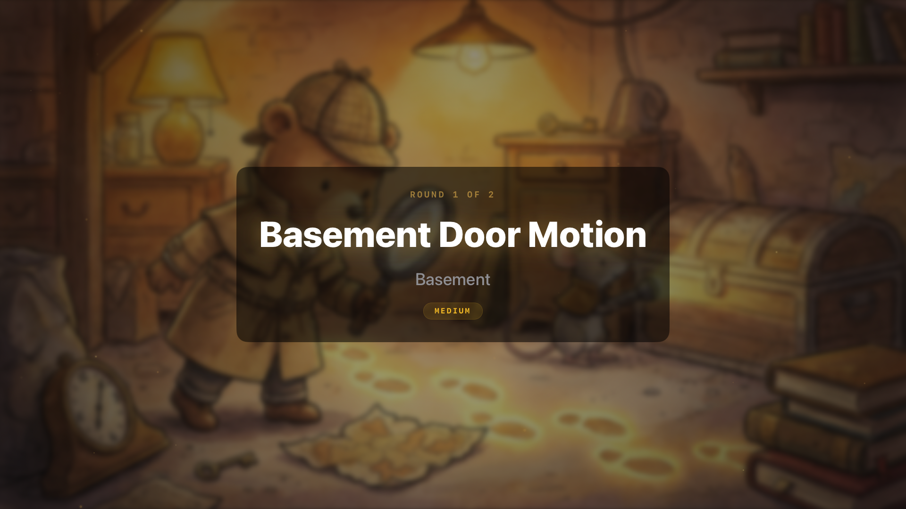

# Mission Control

> **Built with AI assistance** — This project was developed with the help of Claude (Anthropic) for code generation and content writing. Humans reviewed code, designed the architecture, and directed specific engineering design and direction.

A cooperative smart home challenge game for kids. Players race around the house completing missions — turning on lights, opening blinds, triggering motion sensors — while themed AI-generated character voices announce challenges and celebrate victories through your speakers.

**Mission Control turns your smart home into a playground.** An LLM scans your actual Home Assistant devices and generates age-appropriate challenges on the fly. Kids physically run to rooms, flip real switches, and the system detects completion in real-time via Home Assistant's WebSocket API.



## Warnings

- **Unmoderated AI-generated content.** Text, audio, and visual content is generated using a combination of embedded prompts within this project and content influenced by your smart home and device names. The "Challenges" and "Settings" panes offer ways for you to view the generated text which will be converted to audio using ElevenLabs. This content is currently not pre-emptively moderated. This application offers methods to preview and re-generate some, but not all, content.

- **Smart home device control.** This application is designed to interact with your smart home. This can include systems or devices you have present in your Home Assistant instance which you may not want to be tampered with or could cause severe impacts (e.g. garage door openers, connected security systems, yard sprinkler systems, etc). This application is designed to present a menu of suggested challenges for you to review and authorize. Once a challenge is authorized, this application may take action on those devices to "prime" them for the correct state (e.g. turning lights off, to issue a challenge to turn the lights on). **IT IS YOUR RESPONSIBILITY** to review these challenges and **BLACKLIST** any devices which could cause a danger to have an application control.

## Who This Is For

- **Families with a Home Assistant setup** and smart devices (lights, switches, sensors, covers, locks) spread across multiple rooms
- **Kids aged 4–8** who want to run around the house on "missions" (older kids enjoy it too)
- **Parents who want a fun way** to get kids moving and interacting with the house
- **Anyone with speakers in Home Assistant** — audio plays on room-specific `media_player` entities for an immersive experience (Sonos, Google Home, Echo, etc.)

## Who This Is NOT For

- Anyone without Home Assistant — this is deeply integrated with HA's WebSocket and REST APIs
- Anyone expecting a polished consumer product — this is a family hobby project
- Anyone without speakers registered as `media_player` entities in HA — the game needs speakers to announce challenges (or use Apple TV mode to play audio through your TV instead)

## No Pre-Built Media

Mission Control does not ship with any audio, music, or challenge content. All media is generated on-demand using API keys you provide:

- **[ElevenLabs](https://elevenlabs.io/)** generates all voice audio (TTS) and theme intro music (sound effects). Required.
- **[OpenRouter](https://openrouter.ai/)** powers challenge generation via LLM (currently uses Claude Sonnet). Required.

Once generated, all audio is cached permanently in a Docker volume. The first game with a new set of challenges takes a minute or two to generate audio; subsequent games with the same challenges start near-instantly. In some cases, the content may require additional time to generate, causing early games to start with missing artifacts. Running a few "test" games to start with is recommended to ensure content is properly generated.

### API Cost Estimates

> **These are estimates based on pricing at time of writing (March 2026) and may change.** Actual costs depend on your plan tier, usage patterns, and provider pricing changes. **We strongly recommend setting spending limits on both your ElevenLabs and OpenRouter API keys before getting started**, at least until you have a feel for your actual usage.

#### ElevenLabs (TTS + Sound Effects)

All voice audio and intro music is generated via ElevenLabs. Nothing ships pre-generated.

| What | Characters / Calls | When | Cached? |
|------|-------------------|------|---------|
| **Intro music** (30s clip per theme) | 1 SFX generation per theme | First game per theme | Permanently |
| **Intro announcement** | ~200 chars | First game | Yes |
| **Challenge announcements** (standard + 2 funny variants per challenge) | ~150 chars × 3 × rounds played | First game with those challenges | Yes |
| **Hints** (one per challenge) | ~100 chars × rounds | First game | Yes |
| **Timeout phrases** | ~100 chars × 3 per theme | First game per theme | Yes |
| **Success messages** (precached at 5 time values per challenge) | ~100 chars × 5 × rounds | First game | Yes |
| **Outro variants** (precached across round counts × time totals) | ~200 chars × 36 combos | First game | Yes |
| **Runtime success/outro** (actual completion times not in precache) | ~100-300 chars per game | Every game | Yes, per unique time |

**Typical first game (5 rounds, single theme):** ~85 unique TTS clips totaling roughly 10,000–15,000 characters. Subsequent games reuse cached audio except for success messages and outros with new completion times (a few hundred characters per game).

**Fully populating all 3 themes with 30 challenges:** ~30,000–50,000 characters total. The ElevenLabs free tier includes 10,000 characters/month — enough for about one theme's first game. The Starter plan ($5/month, 30,000 characters) covers most of the initial setup. After the cache is populated, ongoing usage is minimal. Check [ElevenLabs pricing](https://elevenlabs.io/pricing) for current details.

#### OpenRouter (LLM + Image Generation)

OpenRouter is used for challenge generation via Claude Sonnet ($3/M input, $15/M output tokens) and scene image generation via Gemini 3 Pro Image Preview / Nano Banana Pro ($2/M input, $109/M output tokens effective price, about 1,120 output tokens per image at 1K resolution).

| What | Model | Cost | When | Cached? |
|------|-------|------|------|---------|
| **Challenge generation** (15-20 challenges) | Claude Sonnet | $0.07 per generation | On-demand in editor | N/A |
| **Field regeneration** (single field) | Claude Sonnet | $0.01 per field | On-demand | N/A |
| **Scene images** (per room per theme + transition + outro) | Gemini | $0.12 per image | First game per room/theme | Permanently |

**Estimated first-time OpenRouter cost for all 3 themes with 8 rooms:** 1 challenge generation ($0.07) + 30 scene images (24 room scenes + 3 transitions + 3 outros at $0.12 each = $3.60) = **about $3.70 total**. No LLM or image generation calls are made during actual gameplay. Ongoing cost is near-zero unless you regenerate challenges or clear the image cache.

Check [OpenRouter pricing](https://openrouter.ai/docs/models) for current model costs — image generation pricing can vary significantly between providers and over time.

#### Total Estimated First-Time Cost

We estimate the total cost to fully set up Mission Control (generate challenges, populate audio cache for one theme, and generate all scene images across 3 themes with 8 rooms) at roughly **$3.70 in OpenRouter usage** plus **10,000–15,000 ElevenLabs characters** (within the free tier for a single theme, or about half the Starter plan's monthly allowance for all 3 themes). After initial setup, ongoing costs per game are negligible.

## How It Works

### 1. Deploy

Pull the Docker image and configure your Home Assistant URL, access token, and API keys:

```yaml
services:
  mission-control:
    image: ghcr.io/dcnoren/mission-control:latest
    ports:
      - "8765:8765"
    volumes:
      - mc-data:/app/data
    environment:
      - HA_URL=http://homeassistant.local:8123
      - HA_TOKEN=your_long_lived_access_token
      - ELEVENLABS_API_KEY=sk_...
      - OPENROUTER_API_KEY=sk-or-v1-...
    restart: unless-stopped

volumes:
  mc-data:
```

```bash
docker compose up -d
```

Open **http://localhost:8765** in your browser.

### 2. Settings Tab



Go to the **Settings** tab and verify:
- **Home Assistant URL** and **access token** are correct
- **ElevenLabs** and **OpenRouter API keys** are filled in
- **Server URL** is set to the LAN-reachable IP of this machine (e.g. `http://192.168.1.100:8765`) — speakers fetch audio from this address, so `localhost` won't work

Click **"Discover Speakers"** to find all `media_player` entities in Home Assistant. Select which speakers the game should use and choose your **hub speaker** — the main speaker that announces challenges (typically your living room or central speaker).

**Speaker volume** defaults to 40% — adjust the slider to a comfortable level for your home and save. You can always come back and change this between games.

If your home has multiple floors, use **"Add Floor"** to define them and assign rooms. This helps the LLM generate better difficulty ratings — challenges on the same floor as the hub speaker are "easy," different floors are "medium" or "hard."

Save your settings.

### 3. Challenges Tab



Switch to the **Challenges** tab:

1. **Scan entities** — click **"Scan"** to discover all devices in Home Assistant (lights, switches, sensors, covers, locks, etc.)
2. **Generate challenges** — click **"Generate"** to send your entities and speakers to the LLM, which creates 15-20 challenges tailored to your actual home
3. **Review suggestions** — browse the generated challenges, approve the ones you want, edit text, delete any you don't like, or regenerate individual fields
4. **Assign speakers** — verify each challenge has the right room speaker for its success message (auto-assigned based on room proximity, but you can override)

### 4. Launch a Game



Back on the main tab, pick a theme, set the number of rounds and difficulty filter, then hit **"Launch Mission."** The game:

1. Plays themed intro music while caching audio in the background
2. Announces each challenge on the hub speaker
3. Monitors Home Assistant in real-time for challenge completion (45-second timeout, hint at 30 seconds)
4. Plays a success message on the room's speaker when kids complete a task
5. Wraps up with a finale and restores all devices to their original states

### 5. Apple TV Companion (Optional)

For a more immersive experience, build and deploy the tvOS companion app to display mission cards and play audio through your TV.





**Setup (one-time):**

1. Copy `MissionControlTV/Config.xcconfig.example` to `MissionControlTV/Config.xcconfig`
2. Set your Apple Developer Team ID in `Config.xcconfig`
3. Open `MissionControlTV/MissionControlTV.xcodeproj` in Xcode
4. Build and run on your Apple TV (requires an Apple Developer account)
5. Enter the server address (e.g. `192.168.1.100:8765`) on the Apple TV

**Two ways to play:**

- **Launch from Apple TV** — start a game directly from the Siri Remote. Quick and simple.
- **Launch from Web UI (recommended)** — the web dashboard gives you more control over theme, rounds, difficulty, and challenge selection. On the Apple TV, select **"Subscribe"** first so it listens for the game, then launch from the web dashboard using **"Launch Mission (Apple TV)."** The Apple TV will automatically pick up the game and display mission cards.

In Apple TV mode, hub audio (announcements, intros, outros) plays through the TV, while room speakers still handle success messages. The tvOS app displays themed mission cards, timers, and results.

## Themes

Each theme has its own voices, music, and personality:

- **Mission Control** — Spy thriller with agent briefings, cinematic music, and a cool British handler voice
- **Bluey** — Inspired by the Australian kids show, with Bluey announcing missions and Dad celebrating successes
- **Snoop & Sniffy** — A cozy mystery detective duo (think Scooby-Doo meets Sherlock) solving cases around the house

All theme intro/outro text, success prefixes, and hint prefixes are editable in the Themes tab — with a "Reset to Default" option if you want to revert.

## Requirements

- [Home Assistant](https://www.home-assistant.io/) with smart devices across rooms
- Speakers registered as `media_player` entities in HA (Sonos, Google Home, Echo, or any HA-compatible speaker) — or an Apple TV for audio-through-TV mode
- [ElevenLabs](https://elevenlabs.io/) API key — for voice and music generation
- [OpenRouter](https://openrouter.ai/) API key — for LLM-powered challenge generation
- A Home Assistant [long-lived access token](https://www.home-assistant.io/docs/authentication/#your-account-profile)
- Docker

## Setup Options

### Option 1: Pull from GHCR (recommended)

Use the docker-compose.yml from the [How It Works](#1-deploy) section above.

### Option 2: Build from source

```bash
git clone https://github.com/dcnoren/mission-control.git
cd mission-control/mission_control_v2
docker compose up --build
```

Open **http://localhost:8765** and configure your HA URL, API keys, and hub speaker in the Settings tab.

### Configuration Reference

All settings can be configured via environment variables or through the web UI. Settings persist in a Docker volume at `/app/data/config.json`.

| Setting | Environment Variable | Description |
|---------|---------------------|-------------|
| Home Assistant URL | `HA_URL` | Your HA instance (e.g. `http://homeassistant.local:8123`) |
| HA Token | `HA_TOKEN` | Long-lived access token from HA |
| ElevenLabs Key | `ELEVENLABS_API_KEY` | For voice and music generation |
| OpenRouter Key | `OPENROUTER_API_KEY` | For LLM challenge generation |
| Server URL | `SERVER_URL` | LAN IP of this machine + port — needed for speakers to fetch audio files |
| Speaker Volume | UI only | Global volume for all game audio on speakers (default 40%) |

## Tips

- **Test mode**: Select a single test speaker to route all audio to one speaker while testing
- **Audio caching**: Generated audio is cached permanently. First game takes longer; subsequent games with the same challenges are near-instant.
- **Challenge editing**: You can customize any challenge text and the LLM can regenerate individual fields
- **Multiple games**: Once challenges are generated, you can play as many games as you want without regenerating

## Dev Environment

For development and testing without a real Home Assistant instance:

```bash
cd dev
docker compose up -d
```

This spins up:
- A **local Home Assistant** instance with 31 fake devices across 7 rooms (Kitchen, Living Room, Master Bedroom, Kids Room, Office, Garage, Hallway)
- **Automated onboarding** — account creation, token setup, area assignment all happen automatically
- **Mission Control** connected to the emulated HA

All entities are toggleable and fire proper `state_changed` WebSocket events. Speakers accept service calls but don't produce actual audio.

- **Mission Control:** http://localhost:8765
- **Home Assistant:** http://localhost:8123 (login: `dev` / `devdevdev`)

Add your API keys in `dev/.env`:
```
ELEVENLABS_API_KEY=sk_...
OPENROUTER_API_KEY=sk-or-v1-...
```

> **Note:** Dev and production both use port 8765. Don't run them simultaneously.

## Architecture

- **Backend**: Python (FastAPI + uvicorn), single container
- **Frontend**: Vanilla HTML/CSS/JS with WebSocket for real-time updates
- **tvOS App**: Native SwiftUI app communicating via WebSocket
- **Integrations**: Home Assistant (WebSocket + REST), ElevenLabs (TTS + SFX), OpenRouter (LLM)
- **Storage**: Docker named volume (`mc-data`) for config, audio cache, and challenge database

## License

This project is licensed under the [GNU Affero General Public License v3.0](LICENSE) (AGPL-3.0).
